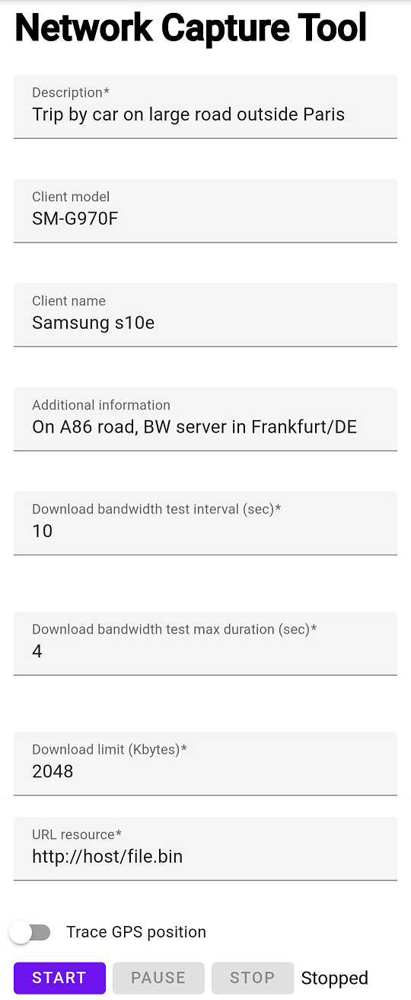

Network Capture Tool
====================

The Network Capture Tool is a website that enables tracing downlink bandwidth and
GPS position to JSON format. Bandwidth is calculated according to speedtest.net 
algorithm: https://help.speedtest.net/hc/en-us/articles/360038679354-How-does-Speedtest-measure-my-network-speeds-#:~:text=How%20results%20are%20calculated
(How results are calculated). If there is insufficient number of samples, total
arithmetic mean is calculated.
GPS position tracing is optional and disabled by default.

Installation
------------

In order to deploy the tool one needs to setup a web server and run this
website on it.
To use GPS position, one should use a secure origin, such as HTTPS.

User Guide
----------

Configure the tool using the following input fields:
- Description - trace description (e.g. "From Stockholm to Szczecin"),
- Client model - client model (e.g. "SM-G390"),
- Client name - client name (e.g. "Samsung Galaxy S10"),
- Note - additional description,
- DL BW test interval (sec) - downlink bandwidth measurement interval in seconds.
  Each measurement starts at specified interval,
- DL BW test duration (sec) - downlink bandwidth measurement duration.
  Each measurement is stopped if this time passes,
- Download limit (kbytes) - download limit in kilobytes.
  Each measurement is stopped after this amount is downloaded. Note that the 
  actual amount can be higher as it depends on how often onprogress handler of 
  XMLHttpRequest is called (see https://xhr.spec.whatwg.org/),
- File URL - file http(s) URL to download ("https://" required in case
  the Network Capture Tool is hosted over HTTPS). File should be larger than
  download limit. File should not be possible to compress. Ensure that bandwidth
  to test server is adequate and does not become the bottleneck,
- Trace GPS position checkbox - confirm that position is shared in browser.

Tracing process is controlled by using buttons: Start, Pause/Resume, Stop.

Output information:
- Status - status of tracing (running, paused, stopped) OR last error,
- DL BW test progress - downlink bandwidth measurement progress bar,
- Measured DL BW - last measured downlink bandwidth in kbps,
- Network - network type (e.g. cellular, WiFi) and/or
  effective network type (slow-2g, 2g, 3g, 4g) (if provided by given browser),
- Position - GPS position (latitude, longitude in Decimal Degrees,
  accuracy in meters) if available,
- JSON - text area containing output JSON content
  (displayed once tracing is stopped),
- Copy button - copies JSON string content to clipboard. It can be saved to a file.

Notes
-----

- use of the tool impacts browser cache increase,
- use of the tool impacts (mobile) data usage,
- higher download limit increases measurement accuracy.
