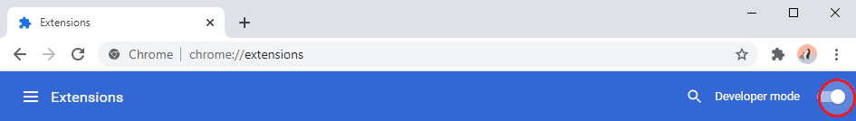
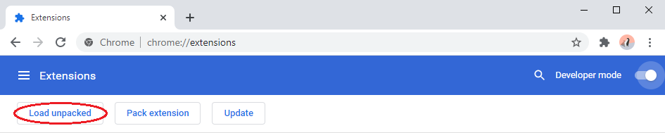
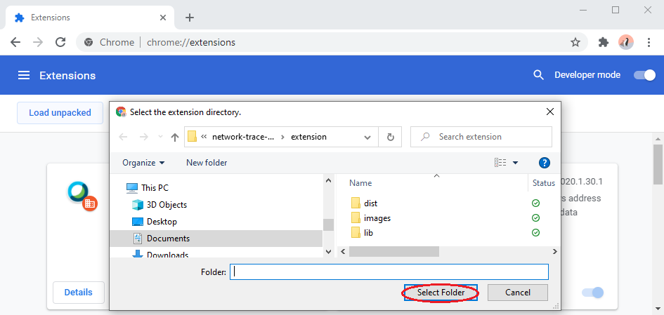
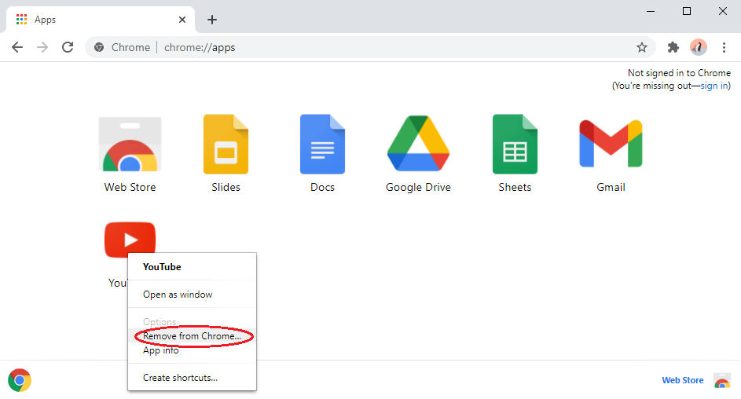
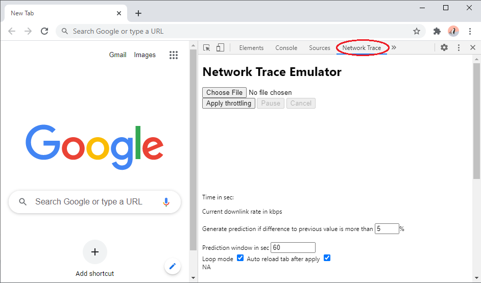

# Installation instructions

This document gives the instruction to install Network Trace Emulator Google
browser extension.

### 1. Open Google Chrome browser and enter `chrome://extensions` in address field.

### 2. Toggle the *Developer Mode* switch.

### 3. Click on *Load Unpacked* button.

### 4. Locate and load the *extension* folder.

### 5. [Optional] Enter `chrome://apps` in address field

### 6. [Optional] Remove Google apps related to website that emulator will be used on (e.g. YouTube)

### 7. Restart the browser.

The Network Trace Emulator will be available in the developer tools, accessed
by pressing `F12`. Navigate the tabs in the Chrome developer window to find it.

